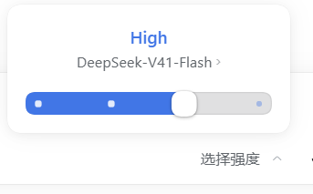

# dsh-ui-polish

DSH（DeepSeek Harness）桌面端的 UI 打磨插件：**宿主界面哪里粗糙，这里补哪里**。
浏览器侧纯注入，不改宿主结构、不碰会话数据，卸载即恢复原样。



## 它做什么

### 1. 浮层毛玻璃

宿主的菜单、选择器等浮层本该是毛玻璃，但材质层被父级的 `isolation: isolate`
截断了 backdrop，实际看起来是"半透明发虚"。本插件把材质画到浮层自己身上，
底色跟随宿主主题变量，浅色/深色自动适配。

### 2. 推理强度滑杆

把「模型选单 → 推理等级 → 4 个单选项」换成一条可拖动的滑杆：

- 拖动实时跟手，松手吸附到最近档位；
- 提交直接调用宿主的 `select()`，菜单全程不关、不闪；
- 档位名从 DOM 读取，换模型、换界面语言都跟着变，不写死；
- 支持键盘（`←/→` 换档、`Home/End` 到两端）与读屏。

### 3. 滑杆特效（fx）

- **流动粒子**：填色里的小点从左向右飘，途中逐渐淡出；粒子被裁剪在填色盒子内，
  因此右端永远贴着滑钮，不会飘到轨道外。
- **Max 档渐变**：只有档位名叫 **Max**（或「最大」）的那一档带紫色特效——滑到它时
  填色由主题蓝渐变到紫，顶部档位名同步变色。顶档叫 xHigh 等的模型不变紫：
  特效认名字不认位置。
- **一次性绽放**：只有在**拖进 Max 档的那一瞬间**，滑钮周围才散开一圈紫白粒子。
  已经在 Max 档时重复拖动不会再放，打开菜单也不会开场就爆。
- **光标**：平时是普通箭头，只有**按住并移动**时才变成抓握拳头（单按不动仍是箭头）。
- **常驻小箭头**：换档提交时宿主会把触发器的箭头临时换成转圈图标，闪一下。
  本插件把这两个可替换图标都隐藏，箭头改由按钮的常驻伪元素绘制，开合朝向
  跟随 `aria-expanded`，换档不再闪。

实心填色条与滑钮的落位都走 `transform`（合成层属性，同一条曲线，永不脱节），
粒子层只沿水平方向流动；系统开启「减弱动效」或高对比模式时自动降级。

### 4. 更顺的模型选择流程

- 点输入框上的模型控件，一次点击直达档位页（滑杆）；
- 点顶部模型行，直达模型列表；
- 在列表里选了带推理档位的模型，自然过渡回滑杆页；没有档位的模型直接完成选择；
- Esc 一次关闭整个菜单，不会退回中间层；
- 触发器上的「模型 · 档位」名称实时更新。

## 安装

```powershell
# dsh CLI 在你本机 DSH 安装目录下的 bin\dsh.cmd，按实际路径改
$dsh = '<DSH_INSTALL_DIR>\resources\runtime\cli\bin\dsh.cmd'
& $dsh plugin --profile desktop add "file:."
```

装完刷新窗口（Ctrl+R）。改过源码后需要 `remove` 再 `add`（pnpm 对 `file:` 依赖是拷贝）。

卸载：

```powershell
& $dsh plugin --profile desktop remove dsh-ui-polish
```

## 配置

`cordis.patch.yml` 的 `config` 段：

| key | 默认 | 说明 |
| --- | --- | --- |
| `enabled` | `true` | `false` = 整层停用 |
| `glass` | `true` | 浮层毛玻璃开关 |
| `tintAlpha` | `0.76` | 底色不透明度，越小越透 |
| `blurPx` | `40` | 背景模糊半径 |
| `slider` | `true` | 推理强度滑杆开关 |
| `fx` | `true` | 滑杆特效：流动粒子 / Max 档紫色渐变 / 绽放 |

运行时开关（DevTools 控制台，立即生效不用刷新）：

```js
dshUiPolish.setTint(0.6)       // 调浓淡
dshUiPolish.off()              // 整层关闭，界面回到宿主原样
dshUiPolish.on()               // 恢复
dshUiPolish.setSlider(false)   // 只要毛玻璃、不要滑杆
dshUiPolish.setFx(false)       // 只要滑杆、不要特效
```

## 开发与测试

```powershell
npm install
npm test    # 6 套 Playwright 回归：freeze / glass / nav / selftest / slider / fx
```

测试用系统 Chrome（可用 `DSHP_CHROME` 指定路径），无需下载浏览器。
`test/live-verify.mjs` 可在真机 DSH 实例里验证毛玻璃与滑杆，用法见脚本头注释。

开发过程中的排查记录、宿主 DOM 契约和踩坑笔记（白屏根因、滑杆几何、Esc 行为、
异步提交窗口等）整理在 [docs/development-notes.md](docs/development-notes.md)，
改 `lib/client.js` 之前建议先读它。

## 注意事项

- 只认宿主的契约属性（`data-*`、`role`），不依赖哈希类名，宿主升级不易误伤；
- 系统开启「减少透明」或浏览器不支持 `backdrop-filter` 时自动加厚底色；
  `forced-colors` 下交还系统配色；
- 外来菜单（权限选单等非模型菜单）不会被插件接管。
